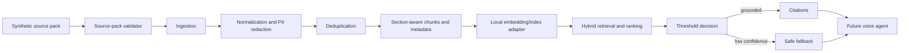

# Phase 2 architecture

This project is a TypeScript modular monolith. It deliberately has no network provider integration in Phase 2.

## Current boundaries

- `data/raw/synthetic`: immutable-style fictional source material plus manifest.
- `data/samples/synthetic`: synthetic test scenarios, not source-of-truth policy.
- `packages/shared`: one central safety policy; later services import rather than copy it.
- `apps/api`: local HTTP health and knowledge-search endpoint.
- `scripts/validate-source-pack.mjs`: structural, hash, JSON, CSV, and basic sensitive-value checks.

## Later persistence decision

SQLite may be used for local prototype persistence behind a repository interface. Neither the domain model nor the forthcoming retrieval interface will depend directly on SQLite, allowing a later PostgreSQL/pgvector or hosted replacement.
